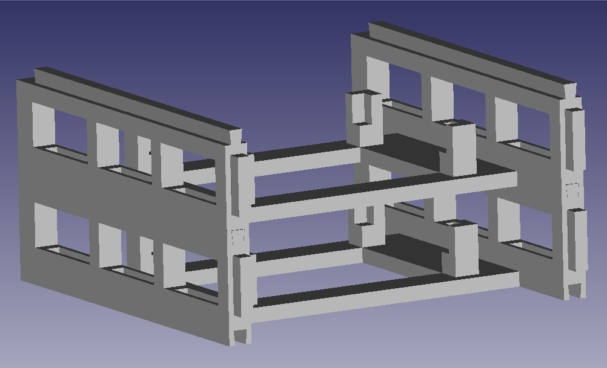

# Modular rack for Toradex boards

This project was created using OpenSCAD, an open-source software for creating 3D CAD solids. With it, you can create a modular rack to stack any Toradex board, either vertically or horizontally. The internal dimensions of each support are adjusted according to the desired board, while the external dimensions remain the same, making it possible to stack these supports.

In the example below, we have the vertical stacking of two support models for Toradex Iris or Mallow boards. The visualization was created using the FreeCAD software.

It is also possible to use these supports on their side, which significantly improves air circulation. In these cases, it is recommended to use the mounting holes to secure the boards with screws.

## How to use

To select your board, you must include the desired board on the first lines of `main.scad` file. The dimensions of each board can be found in the `boards_dimensions directory`. After that, export the STL file and use your preferred slicer to create the file for printing.

